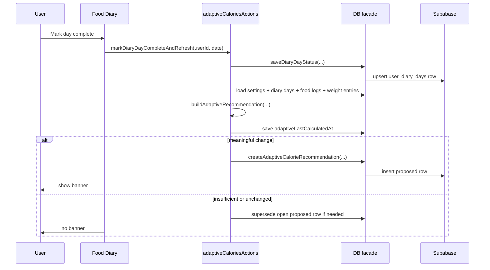
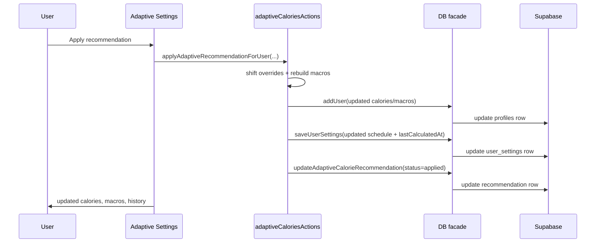

# Adaptive TDEE V1 Analysis

## Executive Summary
**TL;DR:** Adaptive TDEE v1 is now implemented as a client-side, recommend-only loop that uses complete diary days plus recent weight trend to propose quieter calorie-target changes. The app stores recommendation history in Supabase, shows open proposals in the Food Diary and a dedicated settings screen, and never auto-applies changes. Users can accept or reject recommendations, and any manual calorie-affecting override supersedes stale advice.

This document explains:
- what was implemented
- where the logic lives
- how the algorithm works
- how the user flow behaves
- what still needs manual rollout or QA work

## Current Architecture and Status
**TL;DR:** The core feature stack is in place. The remaining work is mostly operational: run the schema migration, test on-device, and decide how far you want to go with automated tests in a repo that currently has no formal test harness.

### Implemented now
- Adaptive history persistence already lives in Supabase via [`adaptive_calorie_recommendations`](./supabase-schema.sql).
- Diary completion state is now modeled with a new `user_diary_days` table in [`supabase-schema.sql`](./supabase-schema.sql).
- Shared adaptive and diary-day types live in [`src/store/DB_TYPES.ts`](../src/store/DB_TYPES.ts).
- Date-range and diary-completion DB methods are exposed through [`src/store/DB.ts`](../src/store/DB.ts).
- Supabase diary-day CRUD and date-range food queries live in [`src/store/supabaseFoodStore.ts`](../src/store/supabaseFoodStore.ts).
- Supabase date-range weight queries and conflict-safe recommendation creation live in [`src/store/supabaseUserStore.ts`](../src/store/supabaseUserStore.ts).
- Pure adaptive math lives in [`src/engine/adaptiveCalories.ts`](../src/engine/adaptiveCalories.ts).
- Orchestration lives in [`src/screens/User_Settings/adaptiveCaloriesActions.ts`](../src/screens/User_Settings/adaptiveCaloriesActions.ts).
- Food Diary UI integration lives in:
  - [`src/screens/Food/FoodDiaryScreen.tsx`](../src/screens/Food/FoodDiaryScreen.tsx)
  - [`src/screens/Food/FoodDiaryMoreSection.tsx`](../src/screens/Food/FoodDiaryMoreSection.tsx)
  - [`src/screens/Food/AdaptiveCaloriesBanner.tsx`](../src/screens/Food/AdaptiveCaloriesBanner.tsx)
- Settings UI integration lives in:
  - [`src/screens/User_Settings/AdaptiveCaloriesSettingsScreen.tsx`](../src/screens/User_Settings/AdaptiveCaloriesSettingsScreen.tsx)
  - [`src/screens/User_Settings/MoreScreen.tsx`](../src/screens/User_Settings/MoreScreen.tsx)
  - [`src/navigation/MoreNavigator.tsx`](../src/navigation/MoreNavigator.tsx)
- Manual calorie target, auto fuel-plan rebuild, and weekly schedule saves now supersede open adaptive proposals in:
  - [`src/screens/User_Settings/userSettingsActions.ts`](../src/screens/User_Settings/userSettingsActions.ts)
  - [`src/screens/User_Settings/CalorieScheduleScreen.tsx`](../src/screens/User_Settings/CalorieScheduleScreen.tsx)
- Weight-save flows now trigger adaptive refresh in:
  - [`src/screens/Weight/WeightScreen.tsx`](../src/screens/Weight/WeightScreen.tsx)
  - [`src/navigation/MainTabNavigator.tsx`](../src/navigation/MainTabNavigator.tsx)
  - [`src/screens/Settings/SettingsScreen.tsx`](../src/screens/Settings/SettingsScreen.tsx)

### Still required outside the repo
- Run the updated SQL in Supabase so `user_diary_days` exists server-side.
- Verify RLS and signed-in user flows on-device with real Supabase auth.
- Decide whether you want a real automated test harness added later. The repo currently typechecks, but it does not currently include Jest, Vitest, or similar infrastructure.

## Product Behavior and User Flow
**TL;DR:** V1 behaves quietly. The app only recommends, never forces. The diary is where days become “trusted,” and settings is where recommendations are reviewed and applied.

### User-facing flow
1. User logs food normally into the diary.
2. User marks a day as complete.
3. If adaptive calories is enabled, the app recalculates against recent complete days and recent weight trend.
4. If a meaningful adjustment exists, a new open proposal is saved to Supabase.
5. The Food Diary shows a banner with a `Review recommendation` CTA.
6. The Adaptive Calories settings screen shows the latest proposal and recommendation history.
7. User can:
   - apply the recommendation
   - keep the current target
   - recalculate manually
   - turn adaptive calories off

### Why the UI is split this way
- **Food Diary** is the natural surface for “day is complete” because that is where the logging trust decision happens.
- **Adaptive Calories settings** is the natural surface for applying or rejecting a target change because it affects calorie allowance, macros, and schedule behavior.
- **No blocking popup** keeps the feature calm and non-intrusive.
- **No push notification** avoids building a whole notification lifecycle before the recommendation model is trusted.

### Recommendation lifecycle


### Apply flow


## Data Model and Persistence
**TL;DR:** V1 uses two kinds of persistence: live settings in `user_settings`, and historical decisions in `adaptive_calorie_recommendations`. Diary trust is stored separately in `user_diary_days`.

### Supabase tables involved

#### `user_settings`
Source: [`supabase-schema.sql`](./supabase-schema.sql)

Purpose:
- per-user adaptive feature state
- last calculation timestamp
- weekly override schedule

Relevant fields:
- `adaptive_calories_enabled`
- `adaptive_mode`
- `adaptive_last_calculated_at`
- `daily_calorie_overrides`

#### `adaptive_calorie_recommendations`
Source: [`supabase-schema.sql`](./supabase-schema.sql)

Purpose:
- historical record of adaptive proposals
- current open recommendation
- audit trail of applied/rejected/superseded decisions

Relevant fields:
- `status`
- `algorithm_version`
- `window_start`, `window_end`
- `confidence`
- `current_base_calories`
- `recommended_base_calories`
- `estimated_tdee`
- `recommended_delta`
- `avg_logged_calories`
- `complete_days_used`
- `weigh_ins_used`
- `trend_start_kg`, `trend_end_kg`
- `observed_weekly_change_kg`
- `reason`
- `input_summary`

#### `user_diary_days`
Source: [`supabase-schema.sql`](./supabase-schema.sql)

Purpose:
- stores whether a local diary date is explicitly trusted as complete
- acts as the gating signal for whether diary calories may enter adaptive analysis

Fields:
- `user_id`
- `date`
- `is_complete`
- `completed_at`
- `created_at`
- `updated_at`

### Why `user_diary_days` is separate from `user_food_entries`
- day completeness is not the same as logging food
- day completeness needs to survive many entries per day
- a complete day can become incomplete later if the user edits it
- a separate table keeps this state explicit and easier to reason about

### Mock data examples

#### Adaptive input window summary
```json
{
  "windowDays": 28,
  "windowStart": "2026-03-20",
  "windowEnd": "2026-04-16",
  "latestCompleteDate": "2026-04-16",
  "daySpan": 22,
  "completeDaysUsed": 18,
  "completeDateKeys": [
    "2026-03-20",
    "2026-03-21",
    "2026-03-22"
  ],
  "totalEntriesUsed": 67,
  "weighInsUsed": 7,
  "trendStartKg": 82.6,
  "trendEndKg": 81.8,
  "observedWeeklyChangeKg": -0.25,
  "avgLoggedCalories": 2264.4
}
```

#### Computed recommendation row
```json
{
  "status": "proposed",
  "algorithmVersion": "v1",
  "windowStart": "2026-03-20",
  "windowEnd": "2026-04-16",
  "confidence": "medium",
  "currentBaseCalories": 2400,
  "recommendedBaseCalories": 2250,
  "estimatedTdee": 2600,
  "recommendedDelta": -150,
  "avgLoggedCalories": 2264,
  "completeDaysUsed": 18,
  "weighInsUsed": 7,
  "trendStartKg": 82.6,
  "trendEndKg": 81.8,
  "observedWeeklyChangeKg": -0.25,
  "reason": "Average logged intake was 2264 kcal/day. Smoothed trend changed by -0.25 kg/week. Estimated maintenance is 2600 kcal/day. Weight-loss offset applied. Current base target is 2400 kcal/day. Recommended base target is 2250 kcal/day."
}
```

#### Banner copy
```json
{
  "title": "A new target is ready to review",
  "body": "Current base target 2400 kcal/day. Suggested target 2250 kcal/day (-150 kcal).",
  "cta": "Review recommendation"
}
```

#### Status transitions
```json
[
  { "from": "proposed", "to": "applied", "when": "user taps Apply recommendation" },
  { "from": "proposed", "to": "rejected", "when": "user taps Keep current target" },
  { "from": "proposed", "to": "superseded", "when": "manual calorie-affecting change or refreshed better proposal replaces it" }
]
```

## Adaptive Algorithm and Heuristics
**TL;DR:** The algorithm estimates maintenance calories from complete-day intake plus smoothed weight change, then applies the app’s existing goal offsets and guardrails.

### Window rule
- fixed 28-day analysis window
- window ends on the latest complete diary day
- today is only used if today was explicitly marked complete

Why:
- stable enough to smooth water and short-term noise
- still responsive enough for weekly-ish recalculation

### Intake rule
- only entries from days marked complete are counted
- food items, recipes, custom meals, and quick adds all count
- incomplete days contribute nothing

Why:
- under-logged days make adaptive models lie
- manual completeness is the smallest, clearest trust signal available in this app

### Weight rule
- use non-deleted weights only
- collapse to latest weight per local day
- smooth with the same EMA style already used by the weight feature

Why:
- same-day duplicates should not overcount
- EMA reduces day-to-day water noise
- using the same smoothing family as the existing weight screen makes the app feel internally consistent

### TDEE estimate
Formula:

`estimatedTdee = avgLoggedCalories - (7700 * weightDeltaKg / daySpan)`

Interpretation:
- if trend weight is rising, estimated TDEE is lower than intake
- if trend weight is falling, estimated TDEE is higher than intake

Why this v1 formula:
- simple enough to reason about
- easy to inspect and debug
- good enough for conservative recommendation-only behavior

### Recommendation rule
1. Estimate maintenance calories.
2. Apply the app’s existing goal offsets:
   - `lose_fat = -350`
   - `maintain = 0`
   - `build_muscle = +250`
3. Round to `CALORIE_TARGET_STEP = 50`.
4. Clamp to valid calorie target bounds.
5. Cap one-cycle change to `150 kcal/day`.
6. If the resulting difference is under `100 kcal/day`, create no proposal.

Why:
- small changes create churn and distrust
- 150 kcal/day is meaningful without being jumpy
- reusing existing goal offsets keeps adaptive behavior aligned with the app’s current nutrition model

### Confidence tiers
- `high`: at least 24 complete days, 8 weigh-ins, 21-day span
- `medium`: at least 18 complete days, 6 weigh-ins, 18-day span
- `low`: at least 14 complete days, 5 weigh-ins, 14-day span
- below minimum: no recommendation at all

### Key implementation functions

#### `buildAdaptiveWindow(...)`
Location: [`src/engine/adaptiveCalories.ts`](../src/engine/adaptiveCalories.ts)

What it does:
- determines the usable 28-day window
- aggregates calories only from complete days
- filters weight entries into the same window
- builds the summary object used by the decision layer

Why it exists:
- keeps data-shaping separate from recommendation logic

#### `getCompleteDiaryDaysInWindow(...)`
Location: [`src/engine/adaptiveCalories.ts`](../src/engine/adaptiveCalories.ts)

What it does:
- finds the latest complete day up to `asOf`
- derives the actual window start and end

Why it exists:
- window anchoring is a domain rule, not a UI rule

#### `collapseAdaptiveWeightsByLocalDay(...)`
Location: [`src/engine/adaptiveCalories.ts`](../src/engine/adaptiveCalories.ts)

What it does:
- removes duplicate weights for the same local day
- leaves the latest measurement for each day

Why it exists:
- same-day duplicates should not distort trend slope

#### `computeAdaptiveWeightTrend(...)`
Location: [`src/engine/adaptiveCalories.ts`](../src/engine/adaptiveCalories.ts)

What it does:
- smooths the collapsed weight series
- returns start trend, end trend, span, and observed weekly pace

Why it exists:
- trend logic is reused by both insufficient-data checks and final recommendation output

#### `estimateAdaptiveTdee(...)`
Location: [`src/engine/adaptiveCalories.ts`](../src/engine/adaptiveCalories.ts)

What it does:
- converts intake + trend into estimated maintenance calories

Why it exists:
- makes the physiology assumption explicit and testable

#### `buildAdaptiveRecommendation(...)`
Location: [`src/engine/adaptiveCalories.ts`](../src/engine/adaptiveCalories.ts)

What it does:
- validates minimum data quality
- estimates maintenance
- applies goal offset and guardrails
- returns one of:
  - `ready`
  - `unchanged`
  - `insufficient`
  - `disabled`

Why it exists:
- this is the single decision point for whether the app should create a recommendation

#### `applyAdaptiveRecommendationToTargets(...)`
Location: [`src/engine/adaptiveCalories.ts`](../src/engine/adaptiveCalories.ts)

What it does:
- applies the new base calories
- shifts every non-null weekly override by the same delta

Why it exists:
- keeps schedule-preservation logic isolated and deterministic

## Interfaces, Actions, and File Placement
**TL;DR:** The feature is split into clean layers: DB access, pure engine, orchestration, and UI.

### DB layer additions
Location: [`src/store/DB.ts`](../src/store/DB.ts)

New methods:
- `getUserFoodLogEntriesBetween(userExternalId, startDate, endDate)`
- `listWeightEntriesBetween(userExternalId, startDate, endDate)`
- `getDiaryDayStatus(userExternalId, date)`
- `listDiaryDayStatusesBetween(userExternalId, startDate, endDate)`
- `saveDiaryDayStatus(input)`

### Supabase store responsibilities

#### `src/store/supabaseFoodStore.ts`
New responsibilities:
- date-range food-entry reads
- `user_diary_days` read/write
- clearing complete-day state when a completed day is changed
- invalidating adaptive freshness when trusted diary input becomes stale

Important behavior:
- if a completed day is edited, the store clears that day’s `is_complete`
- it also invalidates adaptive freshness and supersedes open proposals for safety

#### `src/store/supabaseUserStore.ts`
New responsibilities:
- date-range weight reads
- invalidating `adaptive_last_calculated_at` after weight saves/deletes
- handling recommendation-creation races by refetching the current open proposal if the one-open unique constraint is hit

### Orchestration layer
Location: [`src/screens/User_Settings/adaptiveCaloriesActions.ts`](../src/screens/User_Settings/adaptiveCaloriesActions.ts)

Functions:

#### `refreshAdaptiveRecommendationForUser(...)`
What it does:
- decides whether recalculation is needed
- loads current user, settings, diary completeness, entries, and weights
- runs the pure adaptive engine
- updates `adaptive_last_calculated_at`
- creates or supersedes proposals as needed

Why it exists:
- UI screens should not have to know how the adaptive lifecycle works

#### `applyAdaptiveRecommendationForUser(...)`
What it does:
- applies the recommended base calories
- rebuilds macros using current `proteinFocus` and latest weight
- shifts non-null overrides by the same delta
- updates the recommendation status to `applied`
- updates Redux user state

Why it exists:
- applying a recommendation changes multiple sources of truth and needs one safe path

#### `rejectAdaptiveRecommendationForUser(...)`
What it does:
- marks the proposal as rejected
- updates `adaptive_last_calculated_at` so the same suggestion is not recreated immediately

#### `markDiaryDayCompleteAndRefresh(...)`
What it does:
- marks a local diary day complete
- immediately refreshes adaptive analysis if the feature is enabled

### UI layer

#### Food Diary
- [`src/screens/Food/AdaptiveCaloriesBanner.tsx`](../src/screens/Food/AdaptiveCaloriesBanner.tsx)
- [`src/screens/Food/FoodDiaryScreen.tsx`](../src/screens/Food/FoodDiaryScreen.tsx)
- [`src/screens/Food/FoodDiaryMoreSection.tsx`](../src/screens/Food/FoodDiaryMoreSection.tsx)

Responsibilities:
- show the open recommendation banner
- let the user mark/unmark the selected day as complete
- route to the settings review screen

#### Settings
- [`src/screens/User_Settings/AdaptiveCaloriesSettingsScreen.tsx`](../src/screens/User_Settings/AdaptiveCaloriesSettingsScreen.tsx)
- [`src/screens/User_Settings/MoreScreen.tsx`](../src/screens/User_Settings/MoreScreen.tsx)
- [`src/navigation/MoreNavigator.tsx`](../src/navigation/MoreNavigator.tsx)

Responsibilities:
- toggle the feature
- force recalculation
- apply or reject the latest proposal
- inspect recommendation history

## Edge Cases and Failure Handling
**TL;DR:** The implementation prefers “no recommendation” over a misleading one.

### Insufficient diary completeness
Behavior:
- no recommendation is created
- settings screen explains what is missing

Why:
- incomplete intake data is worse than sparse intake data

### Same-day weight duplicates
Behavior:
- latest local-day weight wins

Why:
- otherwise same-day reweighs bias the trend

### Water-weight or short-term noise
Behavior:
- 28-day window
- EMA smoothing
- 150 kcal cap

Why:
- avoids whiplash from sodium, stress, travel, illness, or menstrual-cycle noise

### Manual calorie-affecting changes
Behavior:
- manual calorie target changes supersede open proposals
- auto fuel-plan rebuilds supersede open proposals
- daily schedule saves supersede open proposals

Why:
- once the user intentionally overrides the app, the old recommendation is stale

### Editing a completed diary day
Behavior:
- completed state is cleared automatically
- open proposals are superseded

Why:
- a recommendation based on a trusted day must stop being trusted once that day changes

### Weight saves or deletes
Behavior:
- user-facing save/delete flows call adaptive refresh
- weight store also invalidates adaptive freshness defensively

Why:
- the adaptive loop should follow the most recent body-weight signal without waiting too long

### Multi-device race
Behavior:
- recommendation creation is protected by the one-open-proposed unique index
- if a conflict happens, the app refetches the already-open proposal and uses that

Why:
- avoids duplicate open proposals from two clients racing

### Local/non-Supabase users
Behavior:
- adaptive UI only makes sense for signed-in synced users
- local-only persistence is not treated as a supported adaptive target

## Testing and Acceptance
**TL;DR:** TypeScript already passes. Formal automated test coverage is still a recommended follow-up because the repo currently does not ship a dedicated test harness.

### Completed verification
- `npx tsc --noEmit` passes after the implementation

### Recommended unit tests once a harness exists
- stable maintenance user keeps roughly the same target
- fat-loss user with slower-than-planned loss gets a modest downward recommendation
- muscle-gain user gaining too quickly gets a modest downward correction
- incomplete days are excluded from intake averages
- short-term weight spikes do not create huge swings
- confidence tiers switch at the correct thresholds
- schedule override shifting preserves weekday structure
- 50-kcal rounding and 150-kcal capping behave deterministically

### Recommended integration tests once a harness exists
- recommendation lifecycle: `proposed -> applied`
- recommendation lifecycle: `proposed -> rejected`
- recommendation lifecycle: `proposed -> superseded`
- completed day becomes incomplete after food log add/edit/delete/copy
- weight save invalidates freshness and refreshes the recommendation
- proposal creation on two devices still results in one open proposal

### Manual QA checklist
1. Run the updated Supabase schema.
2. Sign in with a real Google/Supabase user.
3. Enable adaptive calories in Settings.
4. Log food across multiple days.
5. Mark at least 14 days complete.
6. Log at least 5 weights across at least 14 days.
7. Confirm the banner appears only when a meaningful recommendation exists.
8. Apply the recommendation and verify:
   - profile calorie allowance changes
   - macros are rebuilt
   - non-null daily overrides shift by the same delta
   - recommendation history updates to `applied`
9. Reject a recommendation and verify:
   - banner disappears
   - history keeps the rejected row
   - the same proposal is not recreated immediately
10. Edit a completed diary day and verify:
   - completion is cleared
   - the open proposal disappears or is superseded

## Action Plan and Remaining Work
**TL;DR:** The repo now contains the feature code and the analysis. The two meaningful next steps are database rollout and broader QA.

### Immediate rollout steps
1. Run the latest [`supabase-schema.sql`](./supabase-schema.sql) in the Supabase SQL editor.
2. Rebuild and open the app with a signed-in synced account.
3. Walk the manual QA checklist above.

### Recommended follow-up improvements
1. Add a formal test runner and write the unit/integration tests listed above.
2. Decide whether the settings screen should persist “insufficient data” summaries across reopens.
3. Consider server-side calculation later if you want one shared source of truth across devices.
4. Consider v2 ideas only after v1 trust is proven:
   - optional auto-apply mode
   - activity-aware corrections
   - reminder nudges for incomplete diary days
   - more transparent explanation of trend charts

## Sources and Assumptions
**TL;DR:** Internal repo files define architecture truth; external sources justify the modeling direction and the diary-completeness emphasis.

### Internal sources
- [`src/engine/calorieTargets.ts`](../src/engine/calorieTargets.ts)
- [`src/screens/Onboarding/initialCalculations.ts`](../src/screens/Onboarding/initialCalculations.ts)
- [`src/screens/User_Settings/userSettingsActions.ts`](../src/screens/User_Settings/userSettingsActions.ts)
- [`src/screens/Weight/weightUtils.ts`](../src/screens/Weight/weightUtils.ts)
- [`src/screens/Food/FoodDiaryScreen.tsx`](../src/screens/Food/FoodDiaryScreen.tsx)
- [`src/screens/Food/FoodDiaryMoreSection.tsx`](../src/screens/Food/FoodDiaryMoreSection.tsx)
- [`src/screens/User_Settings/MoreScreen.tsx`](../src/screens/User_Settings/MoreScreen.tsx)
- [`src/navigation/MoreNavigator.tsx`](../src/navigation/MoreNavigator.tsx)
- [`src/store/DB.ts`](../src/store/DB.ts)
- [`src/store/supabaseUserStore.ts`](../src/store/supabaseUserStore.ts)
- [`docs/supabase-schema.sql`](./supabase-schema.sql)

### External references
- NIDDK Body Weight Planner: <https://www.niddk.nih.gov/health-information/weight-management/body-weight-planner>
- Kevin Hall / NIDDK on why the static 3500-calorie rule is limited and dynamic response matters: <https://www.niddk.nih.gov/health-information/professionals/diabetes-discoveries-practice/nih-body-weight-planner>
- Burke et al. on self-monitoring adherence and diary completeness in weight loss: <https://pmc.ncbi.nlm.nih.gov/articles/PMC3268700/>

### Explicit assumptions
- `7700 kcal/kg` is used as a pragmatic v1 heuristic, not as a fully dynamic physiology model.
- Adaptive v1 should prioritize calm, explainable behavior over aggression or speed.
- No recommendation is better than a noisy recommendation.
- Recommendation history belongs in Supabase, while the live current target remains part of normal app profile/settings state.
